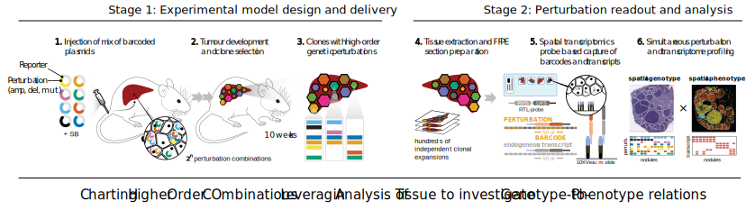

<p align="center">
  
</p>

## Integrated combinatorial functional genomics and spatial transcriptomics of tumors decodes genotype to phenotype relationships

[[`Paper`](https://www.biorxiv.org/content/10.1101/2024.05.14.593940v1)] [[`BibTeX`](#Citation)]

Marco Breinig*, Artem Lomakin*, Elyas Heidari*, Michael Ritter, Gleb Rukhovich, Lio Böse, Luise Butthof, Lena Wendler-Link, Hendrik Wiethoff, Tanja Poth, Felix Sahm, Peter Schirmacher, Oliver Stegle, Moritz Gerstung, Darjus F. Tschaharganeh (*Equal Contribution)

[](https://opensource.org/licenses/MIT)


## Repository overview
This repository conatins code and analysis for [CHOCOLAT-G2P](## "Charting Higher Order COmbinations Leveraging Analysis of Tissue - Genotype to Phenotype"), an experimental method that allows for highly parallel combinatorial screening of drivers with integrated spatial transcriptomics. In the associated manuscript, we generated hundreds of independent clones with highly combinatorial genotypes within a single liver of a model animal. We integrated genotype and phenotype information, including tumour-intrinsic and tumour microenvironment (TME) states, to investigate deeply the relationship between genetics and phenotypical states of liver cancer.

<p align="center">
  
</p>

## Instalation 
The analysis was performed on Ubuntu 22.04.4 LTS, equipped with 40GB RAM and an available GPU. Although GPUs are not mandatory, they significantly accelerate the inference processes (~20h -> ~10 minutes). We recommend installing Python and R packages within a clean Conda environment.

1. Repository Download
```
git clone https://github.com/gerstung-lab/CHOCOLAT-G2P.git
cd CHOCOLAT-G2P
```
2. Setting Up for Genotyping and Genotype-Phenotype Analysis:
```
conda create -n chocolat-g2p python=3.11
conda activate chocolat-g2p
pip install -r requirements.txt
```

3. Setting Up for Phenotyping Scripts:

```
conda create -n chocolat-phenotype python=3.9.12 r-base=4.3.0
conda activate chocolat-phenotype
pip install -r code/phenotype-requirements.txt
Rscript code/utils_dependencies.R
```

We advise setting up a separate environment for phenotyping to prevent conflicts between package versions. Installing all packages may take a few minutes. Installation of R packages may take longer.

## Data availability

The `h5ad` objects containing processed sequencing data and model inference results are available at [Zenodo](https://zenodo.org/records/10986436) (compressed size: ~1GB; decompressed size: ~3.5GB). Raw 10x sequencing data is available upon request. Additionally, we developed a [web-tool](https://chocolat-g2p.dkfz.de/) to explore the data and analysis results interactively.

After downloading the archives decomperss it into `./data`:

```
unzip data_tidy.zip -d data_temp
mv data_temp/data_tidy/* data
rm -r data_temp
```

## Notebooks

After setting up the environment and downloading the data, the results presented in the paper can be reproduced using the analysis notebooks located in the `notebooks` folder. Currently, it is required to run notebooks in the order listed below:

1. `perturb-prob-inference.ipynb`: This notebook provides a general overview of the nodule positions, data preprocessing, and filtering. It trains the Bayesian model that converts spatial distirbution of the perturbation reporters to perturbation probability. We train this model on both the primary data and sequential replicas.

2. `perturb-prob-validation.ipynb`: This notebook assesses the performance of the reporter genes and validates the inferred perturbation statuses using immunohistochemistry (IHC) and target gene expression. It also examines the consistency of inferred probabilities across sequential replicas.

3. `perturb-prob-analysis.ipynb`: This notebook provides a detailed analysis of the genetic composition of the generated cancer population. It translates the inferred statuses of 8 perturbations into the probability of 256 genotypes and analyses the collective population properties, detects pairwise genetic epistasis, and highlights tumorigenic potential of each genotype.

4. `geno-pheno-relations.ipynb`: This notebook reviews tumour-intrinsic expression and the tumour microenvironment (TME). It identifies correlations between genotype and phenotype features in a dual approach: firstly, by grouping phenotypes and examining the plasmid frequency odds ratios; secondly, by predicting gene expression based on the inferred plasmid probabilities with GLMM.

## Citation
```bibtex
@article {Breinig2024.05.14.593940,
	author = {Breinig, Marco and Lomakin, Artem and Heidari, Elyas and Ritter, Michael and Rukhovich, Gleb and B{\"o}se, Lio and Butthof, Luise and Wendler-Link, Lena and Wiethoff, Hendrik and Poth, Tanja and Sahm, Felix and Schirmacher, Peter and Stegle, Oliver and Gerstung, Moritz and Tschaharganeh, Darjus F.},
	title = {Integrated combinatorial functional genomics and spatial transcriptomics of tumors decodes genotype to phenotype relationships},
	elocation-id = {2024.05.14.593940},
	year = {2024},
	doi = {10.1101/2024.05.14.593940},
	publisher = {Cold Spring Harbor Laboratory},
	URL = {https://www.biorxiv.org/content/early/2024/05/17/2024.05.14.593940},
	eprint = {https://www.biorxiv.org/content/early/2024/05/17/2024.05.14.593940.full.pdf},
	journal = {bioRxiv}
}

```
